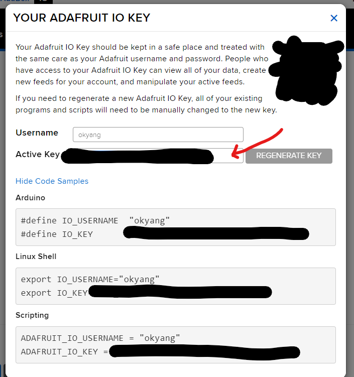

# LYWSD03MMC Monitoring with Adafruit IO

This project shows you how to send temperature and humidity telemetry to [Adafruit IO](https://io.adafruit.com) using the LYWSD03MMC. It's a cute little temperature and humidity sensor with LCD display as pictured below (ﾉ◕ヮ◕)ﾉ*:･ﾟ✧

## Materials

- [ ] Miji Bluetooth Temperature/Humidity Sensor with LCD Display (LYWSD03MMC)
- [ ] Raspberry Pi 3 or 4

## 1 - Setup your Adafruit IO
Please refer to the [Adafruit IO guide](https://learn.adafruit.com/adafruit-io-basics-analog-input/adafruit-io-setup-uniontownlabs) for a more detailed example 😊.

1. Create an account on [Adafruit IO](https://io.adafruit.com/)
2. Take note of your Adafruit IO key

3. Create a new feed

4. Open up your feed page for your new feed
5. On the side panel click on **Feed Info** and take note of your feed key

## 2 - Clone the Repo
1. Clone this repo in a terminal by running `git clone https://github.com/okyang/tinyOkayProjects.git`
1. Switch directories `cd LYWSD03MMC_monitoring_adafruitio`
1. Install the requirements using the command `pip3 install -r requirements.txt`
1. create a `.env` file based on the following template `.env.template`. Use the information you got from the previous section!

## 3 - Run the Code
1. Make sure your LYWSD03MMC is on
1. Make sure your Raspberry Pi's bluetooth is on
1. Run your code! `python3 monitoring.py`

## References
1. [Adafruit CircuitPython BLE LYWSD03MMC](https://github.com/adafruit/Adafruit_CircuitPython_BLE_LYWSD03MMC)
