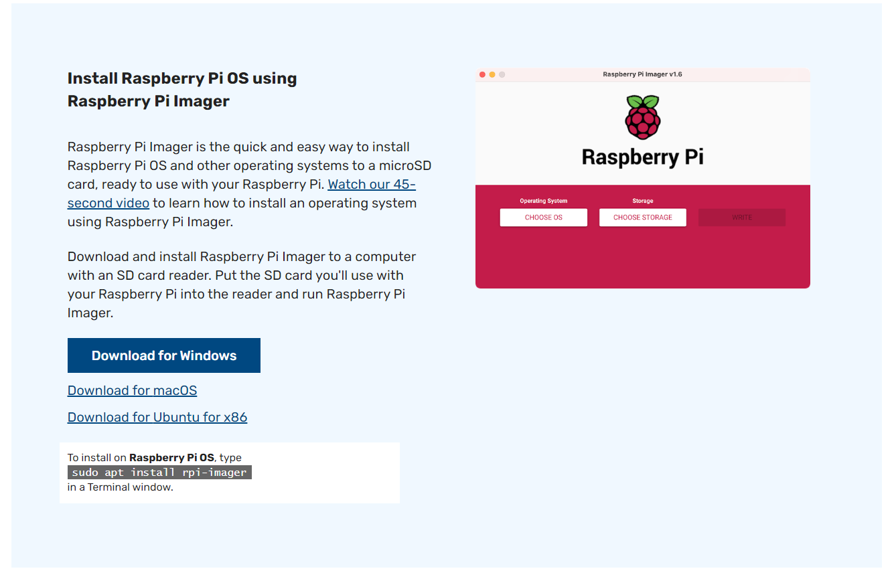
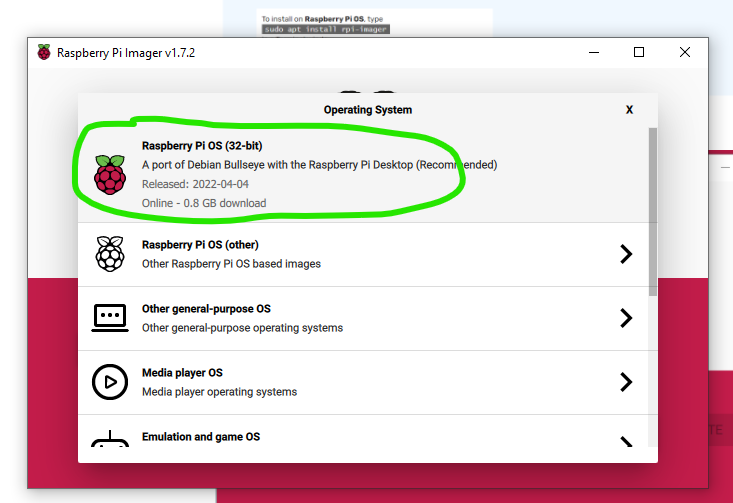
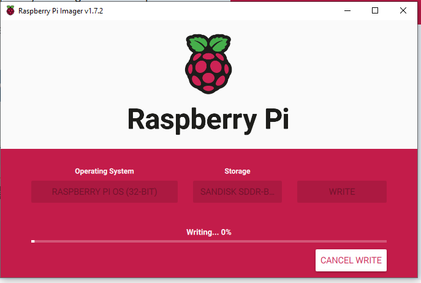
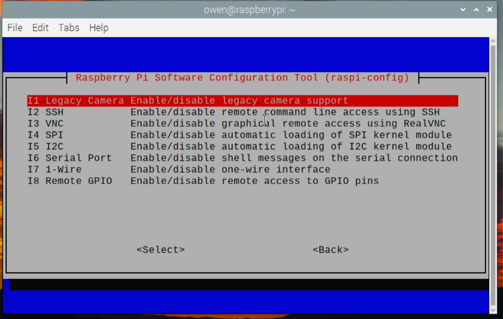
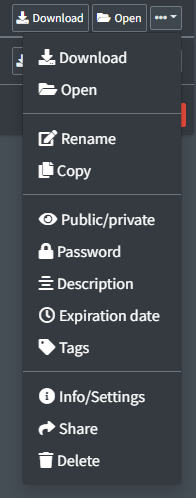
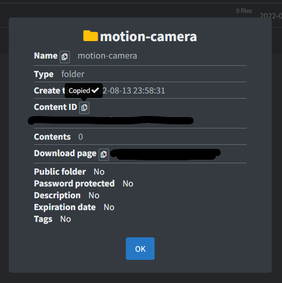
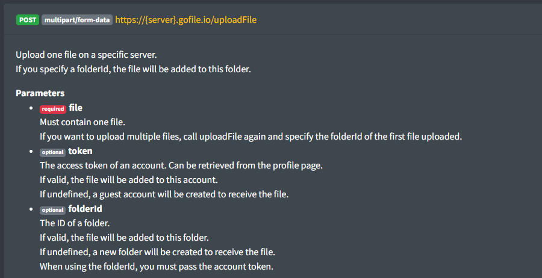
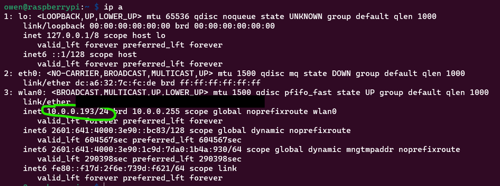

# Motion Activated Raspberry Pi Camera

This pir motion activated Raspberry Pi camera project will take and upload videos to the [Gofile - Free file sharing and storage platform](https://gofile.io/welcome) server via an HTTP address. The GoFile server will serve as an online database to save the video files and as a interface to browse through motion captured videos.


**Features**
- Senses motion
- Records video that is converted to a MP4 format
- Sends MP4 files to [Gofile - Free file sharing and storage platform](https://gofile.io/welcome)
- Code is logged to `app.log` file

## Materials

- [ ] Raspberry PI 4

- [ ] microSD Card

- [ ] Raspberry Pi Camera v2.1

- [ ] Raspberry Pi T-cobbler

- [ ] Solid  core wires

- [ ] Female header pins

## Tools

- [ ] Keyboard

- [ ] Monitor

- [ ] Personal Computer

- [ ] microSD Card USB Adapter

- [ ] Soldering iron

- [ ] Helping Hands

## 1 - Setup the Raspberry PI OS

Following [Raspberry PI OS Install Instructions](https://www.raspberrypi.com/software/).

1. Download Raspberry Pi Imager

2. Install the Raspberry Pi Imager Software to your OS (Windows, Mac, or Linux)

   

3. Open the Raspberry Pi Imager Software Program

   

4. Plug in your SD Card

5. Click **Choose OS**

6. Click **Raspberry Pi OS (32-bit)**

   

7. Click **Choose Storage**

8. Select your microSD card

   

9. Hit the **Write** button

   

10. Wait for writing to complete

    

11. 🥳 OS is ready!

## 2 - Enable Raspberry Pi Camera

1. Open the terminal (shortcut: **ctrl + alt + T**)

2. `sudo raspi-config`

   

3. Select **Interfacing Options**

   

4. Select **Legacy Camera Enable** to enable the camera

   

5. (Optional) Another thing I like to do is to enable ssh

   

6. Reboot the Raspberry Pi

## 3 - Circuit

We'll be creating the circuit as shown in the diagram below. to interact with the camera and the PIR motion sensor.


1. Connect the Camera Module to your Raspberry Pi (more details in [Getting Started with Picamera](https://projects.raspberrypi.org/en/projects/getting-started-with-picamera/2))

2. Attach some female header pins to the T-cobbler and solder them to a Prototyping Board

3. Solder the connections from the T-cobbler prototyping board to the PIR motion sensor as in the diagram above

4. The T-cobbler will then be connected to the Raspberry Pi via the ribbon cable. That way you don't have to solder directly to the GPIO pins. Make sure that the ribbon cable is oriented the right way when connecting to the Raspberry Pi.

## 4 - Setup GoFile

[Gofile](https://gofile.io/welcome) is a unlimited and free file sharing and storage platform that is secure and privacy focued. We'll be using this as our server to store our videos onto. Note, that these files will be hosted on the Gofile servers temporarily for about a week if unused. For my purposes, that was okay. There is also a paid tier via their patron to store the files.

1. Create a **my_secrets.py** file in the same folder as this file

2. Visit the page [Gofile - Free file sharing and storage platform](https://gofile.io/welcome)

3. Login to your account (yes login, Gofile makes the login system very simple)

   

4. Find your account token by clicking on **My Profile**

   

5. Locate your account token on the bottom of your profile page as shown below. Add `gofile_token = "<your_token>"` to the **my_secrets.py** file ( 🚨 Don't include <> in your string).

   

6. Create a new folder by clicking **Create folder**

   

7. Name your folder. (I called it **motion-camera**)

   

8. By default the new folder is a private folder, but if you ever need to change it click on the 3 dots (kebab menu icon?)

   

9. In the same 3 dots menu, click on **Info/Settings**. Add `gofile_folder = "<your_folder_id>"` to the **my_secrets.py** file ( 🚨 Don't include <> in your string).

   

## 5 - Running the code

1. Install `gpac` on the terminal. the code will use this to convert a `.h264` file to a `.mp4` file. This is useful because the camera module library doesn't saves to a `.h264` format.

   ```bash
   sudo apt-get install -y gpac
   ```

2. To run immediately:

   ```bash
   python3 <code_path>/c
   ```

3. To run on startup refer to Appendix section D

```mermaid
graph TD
    A(Start) --> B(Camera Setup)
    B --> C{Waiting for Motion}
    C --> |motion| D(Recording)
    C --> |no motion| C

    D --> E(Wait for no motion)
    E --> F(Save to tmpfs)
    F --> FF(Convert to mp4)
    FF --> G(Upload to gofile)
    G --> H(Delete from tmpfs)
    H --> C
```

#### Saving to go file

I'm going to use the following API from [Gofile API](https://gofile.io/api)



I want to use the `token` parameter so it gets associated with my account and not a random guest account that I'll probably lose access to.

## Appendix

### A - Set Static IP address

Instructions from [Make Use Of - Set Static IP](https://www.makeuseof.com/raspberry-pi-set-static-ip/).

1. Find your **NETWORK INTERFACE** - your network connection type (eg. eth0, wlan0, etc.)

   ```bash
   ip a
   ```

   

2. Find your current **IP ADDRESS** - your current ip address

   ```bash
   ip a
   ```

   

3. Find your **ROUTER_IP** - the gateway IP address for your router on the local network. Use the first ip address listed.

   ```bash
   ip r | grep default
   ```

4. Find your **DNS_IP** - the DNS IP address (tpically the same as your router's gateway address).

   ```bash
   sudo cat /etc/resolv.conf
   ```

5. Append the following lines to the end `/etc/dhcpcd.conf` file

   ```bash
   interface <NETWORK INTERFACE>
   static ip_address=<IP ADDRESS>/24
   static routers=<ROUTER_IP>
   static domain_name_servers=<DNS_IP>
   ```

### B - Setup SSH Passwordless Login

⚠ Make sure you enable `ssh` in your raspberry pi first.

These instructions will follow [How to Enable Password-less Login on Raspberry Pi](https://www.jaredwolff.com/passwordless-ssh-raspberry-pi/).

1. On the computer you would like to ssh from

   ```bash
   ssh-keygen
   ```

2. Create authorized keys file

   ```bash
   cat ~/.ssh/id_rsa.pub | ssh <pi_username>@<raspbery_pi_ip_address> 'mkdir .ssh/ && cat >> .ssh/authorized_keys'
   ```

3. Now when you should be able to ssh without being prompted with a password

   ```bash
   ssh <pi_username>@<raspberry_pi_ip_address>
   ```

### C - Converting H264 to MP4 File

When using the Raspberry Pi Camera, we save the video files as a `.h264` raw format. To make the video more accesible, we usually want to convert it to a `.mp4` format.

1. `sudo apt-get install -y gpac`
2. `MP4Box -add <YOUR_VIDEO_FILE_NAME>.h264 <YOUR_VIDEO_FILE_NAME>.mp4`

### D - Run Program From Startup

1. `sudo crontab -e`

2. Add the following line to the end of your `crontab` file. Replace ` <code_path>` with the path to the `pir_cam.py` file.

   ```bash
   @reboot sleep 30; sudo python3 <code_path>/pir_cam.py &For example:
   ```

   For example:

   ```bash
   @reboot sleep 30; sudo python3 /home/owen/github/tinyOkayProjects/pir_activated_cam_2/pir_cam.py &Save and exit
   ```

3. Now reboot the Pi and you should see your program start saving log files on startup.

### E - References

(Raspberry Pi Camera)

- [Raspberry Pi | Getting started with the Camera Module](https://projects.raspberrypi.org/en/projects/getting-started-with-picamera/6) - really well-done beginner friendly tutorial on the Raspberry Pi Camera Module

(Raspberry Pi Autostart)

- [Estefannie Explains | How to start a script at start-up on a Raspberry PI](https://www.youtube.com/watch?v=zRXauWUumSI&list=PLTLCCkYfLvNSMwxfhaxTO1dbt3ZYJbzNt&index=8) - great tutorial on how to run a progran on startup using `cron`
